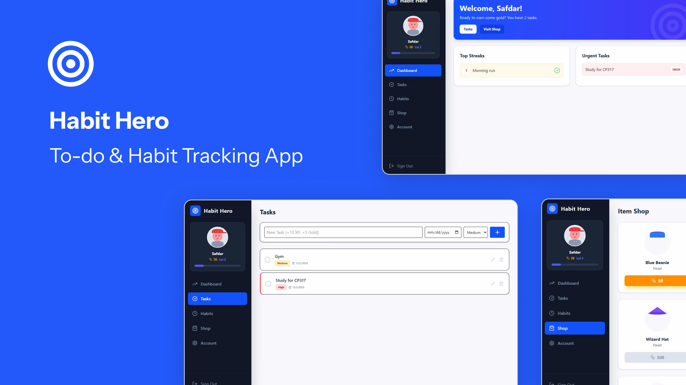
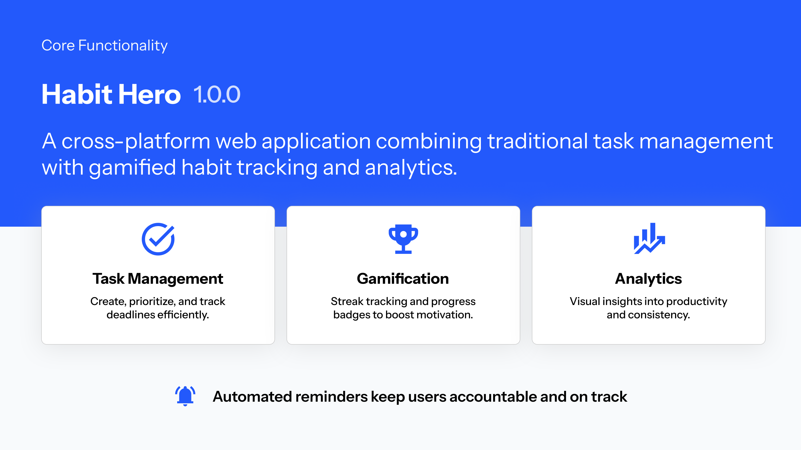

# Habit Hero

## **Gamify your productivity.** 🎮

## 📖 Overview

**Habit Hero** is a cross-platform desktop application designed to bridge the gap between productivity and entertainment. By combining traditional task management with RPG-style gamification, Habit Hero helps users build consistency, track productivity, and stay motivated.

As you complete tasks and maintain habit streaks, you earn **XP** to level up and **Gold** to unlock customization items in the virtual shop.

---

## 🚀 Key Features

* **Task Management:** Create, edit, and delete tasks with granular priority levels (Low, Medium, High) and strict due dates.
* **Habit Streaks:** specific tracking for daily habits—keep the chain alive to maximize rewards.
* **Gamification Engine:** A robust economy system where productivity earns XP and Gold to buy avatars and accessories (e.g., Wizard Hats, Beanies).
* **Real-Time Analytics:** Visualize your productivity trends with dynamic charts and progress tracking.
* **Smart Notifications:** Automated, non-intrusive
